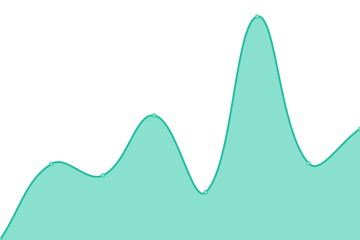
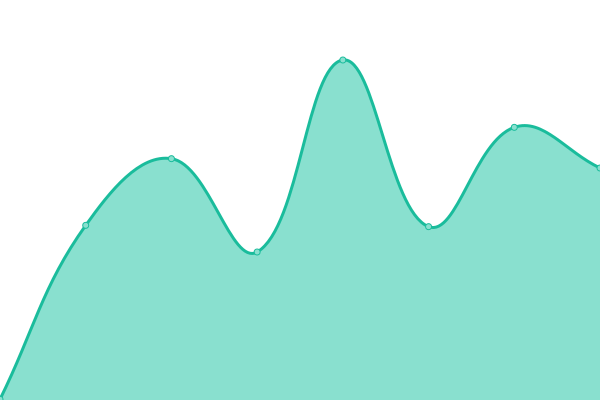

# [📈 Live Status](https://demo.upptime.js.org): <!--live status--> **🟥 Complete outage**

This repository contains the open-source uptime monitor and status page for [matiastorres-dev](https://demo.upptime.js.org), powered by [Upptime](https://github.com/upptime/upptime).

With [Upptime](https://upptime.js.org), you can get your own unlimited and free uptime monitor and status page, powered entirely by a GitHub repository. We use [Issues](https://github.com/matiastorres-dev/status/issues) as incident reports, [Actions](https://github.com/matiastorres-dev/status/actions) as uptime monitors, and [Pages](https://demo.upptime.js.org) for the status page.

<!--start: status pages-->
<!-- This summary is generated by Upptime (https://github.com/upptime/upptime) -->
<!-- Do not edit this manually, your changes will be overwritten -->
<!-- prettier-ignore -->
| URL | Status | History | Response Time | Uptime |
| --- | ------ | ------- | ------------- | ------ |
|  [Intermediario](https://elintermediario.com.ar) | 🟥 Down | [intermediario.yml](https://github.com/matiastorres-dev/status/commits/HEAD/history/intermediario.yml) | 

 0ms
     
 | 

<a href="https://matiastorres-dev.github.io/status/history/intermediario">0.00%</a>
    

|  [Ropa de marca (admin)](https://admin.ropademarca.com.ar) | 🟥 Down | [ropa-de-marca-admin.yml](https://github.com/matiastorres-dev/status/commits/HEAD/history/ropa-de-marca-admin.yml) | 

 0ms
     
 | 

<a href="https://matiastorres-dev.github.io/status/history/ropa-de-marca-admin">0.00%</a>
    

|  [Ropa de marca (api)](https://api.ropademarca.com.ar) | 🟥 Down | [ropa-de-marca-api.yml](https://github.com/matiastorres-dev/status/commits/HEAD/history/ropa-de-marca-api.yml) | 

 0ms
     
 | 

<a href="https://matiastorres-dev.github.io/status/history/ropa-de-marca-api">0.00%</a>
    

<!--end: status pages-->

[**Visit our status website →**](https://demo.upptime.js.org)

## 📄 License

- Powered by: [Upptime](https://github.com/upptime/upptime)
- Code: [MIT](./LICENSE) © [matiastorres-dev](https://demo.upptime.js.org)
- Data in the `./history` directory: [Open Database License](https://opendatacommons.org/licenses/odbl/1-0/)
